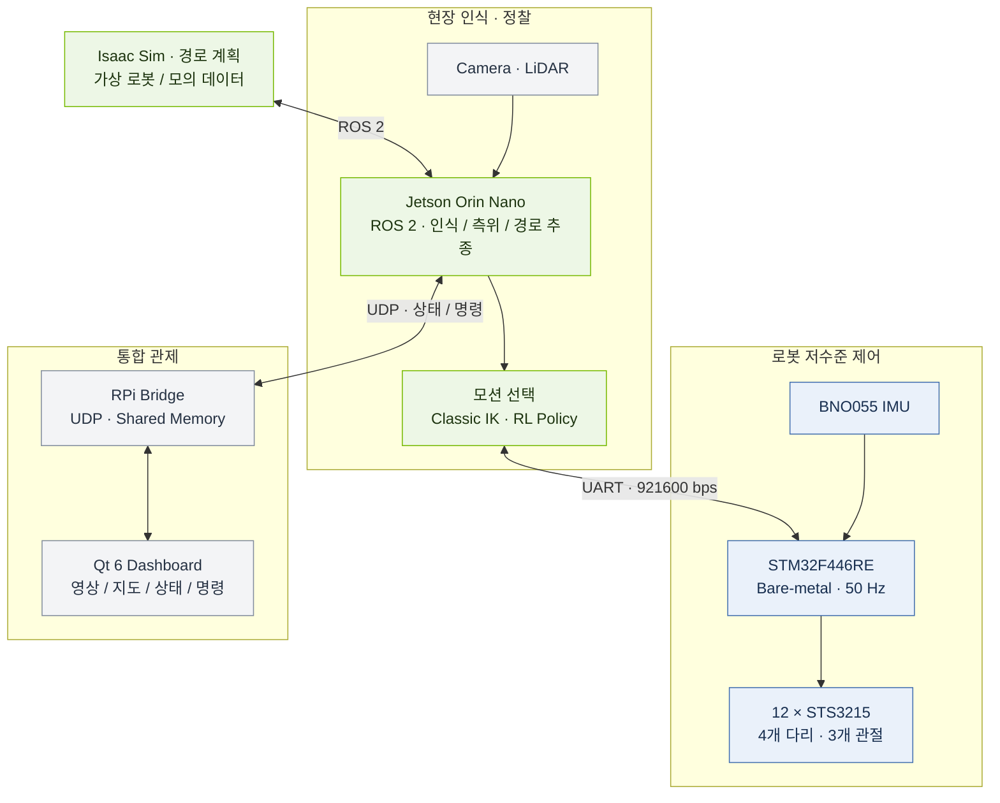

# 🐾 SPOT_GET_IT

> **커스텀 Spot Micro 기반 험지 탐사·재난 정찰 4족 보행 로봇**<br>
> 로봇의 움직임부터 현장 인식, 다중 로봇 관제까지 연결하는 임베디드·AI 프로젝트.


**[📖 프로젝트 Wiki](docs/wiki/Home.md)** · **[🚀 설치 가이드](docs/wiki/Setup.md)** · **[🎮 실행 가이드](docs/wiki/Operation.md)** · **[⚙️ 장비 설정](docs/wiki/Configuration.md)**

---

## 📌 프로젝트 소개

**SPOT_GET_IT**은 사람이 접근하기 어려운 현장의 정보를 수집하고 관제하기 위한 4족 보행 로봇 프로젝트입니다.
카메라와 LiDAR 데이터를 처리하는 **Jetson**, 관절을 제어하는 **STM32**,
여러 로봇의 정보를 보여주는 **Raspberry Pi·Qt 대시보드**를 하나의 시스템으로 구성합니다.

실물 로봇을 위한 제어 코드와 함께 **Isaac Sim 디지털 트윈**, **RL 보행 정책 학습**, **YOLO 인명 탐지 학습 자료**를 제공합니다.

### 주요 기능

| | 기능 | 구현 내용 |
| :---: | --- | --- |
| 🦿 | **고전 제어 & 강화학습 보행** | IK 기반 gait 생성과 ONNX 정책 추론, 모션 선택 및 관절 목표 전달 |
| 👁️ | **현장 인식** | 카메라 기반 person 탐지, LiDAR 포인트클라우드·장애물·점유격자 처리 |
| 🧭 | **정찰 경로** | 로봇별 전역 경로 생성, 측위·TF 처리, 로컬 경로 계획과 추종 |
| 🖥️ | **다중 로봇 관제** | 영상·LiDAR·위치·경로·이벤트 수신 및 Qt 대시보드 제어 |
| 🌐 | **디지털 트윈** | Isaac Sim 씬, ROS 2 상태 연동, 모의 로봇 데이터 송신 |
| 🔩 | **임베디드 제어** | 12개 서보, IMU 피드백, 명령 유효성 검사와 stale 처리 |

---

## 🏗️ 시스템 아키텍처



| 계층 | 담당 역할 |
| --- | --- |
| **Jetson · High-level** | 센서 처리, 경로 추종, 보행 정책 추론, 동작 선택 |
| **STM32 · Low-level** | 관절 명령 적용, 서보·IMU 입출력, 통신 및 상태 감시 |
| **RPi · Control station** | 로봇 데이터 중계, 공유메모리 관리, 관제 UI |

STM32는 **FreeRTOS 없이 bare-metal 제어 루프**를 사용합니다.
현재 통신 경로는 UART이며, `spi_protocol`이라는 파일명은 기존 프로토콜 명칭을 유지한 것입니다.

---

## 🧰 기술 스택

| 영역 | 기술 |
| --- | --- |
| **로봇 플랫폼** | Spot Micro · Jetson Orin Nano · STM32F446RE |
| **임베디드** | C · STM32 HAL · STS3215 · BNO055 · UART / DMA |
| **로봇 소프트웨어** | Ubuntu 22.04 · ROS 2 Humble · C++ / Python · colcon |
| **인식** | OAK 카메라 · LiDAR · YOLO · TensorRT / ONNX Runtime |
| **보행 학습** | Isaac Gym · legged_gym · rsl_rl · ONNX |
| **관제** | Raspberry Pi · Qt 6 · CMake · UDP · POSIX 공유메모리 |
| **시뮬레이션** | Isaac Sim · USD · ROS 2 연동 |

---

## 📂 저장소 구조

| 디렉터리 | 역할 |
| --- | --- |
| [`firmware/`](S14P31A409-develop/S14P31A409-develop/firmware/README.md) | STM32 제어 루프·관절 제어·IMU·UART 프로토콜 |
| [`robot_ws/`](S14P31A409-develop/S14P31A409-develop/robot_ws/README.md) | Jetson ROS 2 인식·측위·주행·제어·통신 패키지 |
| [`ai_training/`](S14P31A409-develop/S14P31A409-develop/ai_training/README.md) | RL 보행 정책과 YOLO 탐지 모델 학습·변환·실험 기록 |
| [`d_twin/`](S14P31A409-develop/S14P31A409-develop/d_twin/README.md) | 전역 경로 계획, 모의 실행, Isaac Sim 씬·스크립트 |
| [`rpi/`](S14P31A409-develop/S14P31A409-develop/rpi/README.md) | C 브리지 데몬과 Qt 관제 대시보드 |
| [`hardware/`](S14P31A409-develop/S14P31A409-develop/hardware/README.md) | 하드웨어 설계 문서와 CAD·STL·STEP |
| [`tools/`](S14P31A409-develop/S14P31A409-develop/tools/README.md) | SPI 더미 통신·보행 시험 도구 |
| [`shared/`](S14P31A409-develop/S14P31A409-develop/shared/README.md) | 공통 정의가 위치한 실제 소스 안내 |
| [`docs/wiki/`](docs/wiki/Home.md) | 설치·설정·실행·트러블슈팅 가이드 |

<details>
<summary><b>🔎 ROS 2 패키지 구성 펼쳐보기</b></summary>

```text
robot_ws/src/
├── bringup/        robot_bringup
├── control/        actuator_bridge · classic_control · motion_manager
│                   rl_locomotion · locomotion_common
├── perception/     camera_perception · lidar_perception
├── localization/   spot_localization
├── navigation/     spot_navigation
├── network/        camera_stream_sender · lidar_sparse · lidar_stream_sender
│                   pose_path_event_sender · network_bringup
├── interfaces/     robot_interfaces
├── experimenter/   lidar_collector · video_collector
└── vendor/         oak_camera_driver
```

전역 경로 계획과 모의 실행 패키지는 `d_twin/ros2/`에서 별도로 관리합니다.

</details>

---

## 🔩 하드웨어 구성

| 구성 요소 | 모델·구성 | 역할 |
| --- | --- | --- |
| **메인 연산 장치** | Jetson Orin Nano | ROS 2, 인식, 보행 추론 |
| **제어 MCU** | STM32F446RE | 50 Hz 제어 루프, 서보·IMU 인터페이스 |
| **관절 구동부** | STS3215 × 12 | 4개 다리 × 3개 관절 |
| **자세 센서** | BNO055 | IMU 상태 피드백 |
| **현장 센서** | OAK 카메라 · LiDAR | 영상·거리 정보 수집 |
| **관제 장치** | Raspberry Pi · Qt 앱 | 여러 로봇의 상태 표시와 제어 |

📐 **[하드웨어 설계](S14P31A409-develop/S14P31A409-develop/hardware/docs/hardware_design.md)** · **[전원 시스템](S14P31A409-develop/S14P31A409-develop/hardware/docs/power_system.md)**

---

## 🚀 시작하기

이 Git 저장소 루트에서 진행합니다. 소스는 `S14P31A409-develop/S14P31A409-develop`에 있습니다.
ROS 2 Humble, colcon, rosdep이 준비된 환경이 필요합니다.

### 01 · Jetson 워크스페이스 빌드

```bash
export PROJECT_ROOT="$PWD/S14P31A409-develop/S14P31A409-develop"
source /opt/ros/humble/setup.bash
cd "$PROJECT_ROOT/robot_ws"
rosdep install --from-paths src --ignore-src -r -y
colcon build --symlink-install
source install/setup.bash
```

### 02 · 로봇에 맞게 설정

UART 장치·로봇 ID·관절 캘리브레이션·모델 파일과 관제 수신 주소를 확인합니다.
기본 IP `127.0.0.1`과 `/path/to/` 경로는 배포용 예시이므로 실행 장비에 맞게 지정해야 합니다.

### 03 · 필요한 구성 실행

```bash
# UART 브리지
ros2 launch actuator_bridge actuator_bridge.launch.py

# 통합 보행 구성: 모델·관절·통신 설정 후 별도로 실행
ros2 launch robot_bringup rl_motion_manager.launch.py
```

> 통합 보행 런치는 UART 브리지를 포함합니다. 위 두 명령은 실행 방식 예시이며 동시에 실행하지 않습니다.

STM32는 `firmware/`를 STM32CubeIDE에서 가져와 빌드합니다.
관제 앱과 시뮬레이터의 준비·실행 절차는 **[설치](docs/wiki/Setup.md)** → **[설정](docs/wiki/Configuration.md)** → **[실행](docs/wiki/Operation.md)** 순서로 확인하세요.

---

## 📡 통신 프로토콜

### Jetson ↔ STM32

| 방향 | 프레임 크기 | 주요 데이터 |
| --- | :---: | --- |
| **Command → STM32** | 117 B | 동작 모드, 12관절 목표각, 변화량 제한, gait 상태 |
| **Feedback → Jetson** | 261 B | 관절 위치·속도·부하·온도, IMU, 전압, 상태·오류 |

**UART 921600 bps · 50 Hz · Little-endian · CRC-16/CCITT-FALSE**

정의: [`firmware/Inc/spi_protocol.h`](S14P31A409-develop/S14P31A409-develop/firmware/Inc/spi_protocol.h) · [`firmware/Inc/uart_jetson.h`](S14P31A409-develop/S14P31A409-develop/firmware/Inc/uart_jetson.h)

### 로봇 ↔ 관제

| 채널 | 용도 |
| --- | --- |
| **UDP 9000** | 로봇의 영상·LiDAR·위치·상태·경로 데이터 |
| **UDP 9001** | 로봇으로 보내는 명령·하트비트 |
| **UDP 9002** | 외부 PC 연동 |
| **POSIX 공유메모리** | 브리지 ↔ Qt 대시보드 |

정의: [`rpi/bridge_app/proto.h`](S14P31A409-develop/S14P31A409-develop/rpi/bridge_app/proto.h) · [`rpi/bridge_app/shm_def.h`](S14P31A409-develop/S14P31A409-develop/rpi/bridge_app/shm_def.h)

---

## 📚 문서

| 안내 | 내용 |
| --- | --- |
| **[🏠 Wiki 홈](docs/wiki/Home.md)** | 전체 문서 탐색 |
| **[🏗️ 아키텍처](docs/wiki/Architecture.md)** | 모듈 구성과 데이터·제어 흐름 |
| **[🚀 설치·빌드](docs/wiki/Setup.md)** | Jetson, STM32, 관제, 시뮬레이션 환경 |
| **[⚙️ 설정](docs/wiki/Configuration.md)** | IP, 모델, 경로, ID, 장치 설정 |
| **[🎮 실행·운용](docs/wiki/Operation.md)** | 구성별 실행과 동작 모드 |
| **[🔧 트러블슈팅](docs/wiki/Troubleshooting.md)** | 실행 전제, 알려진 제한, 문제 확인 순서 |
| **[📄 외부 자료·라이선스](docs/wiki/Third-Party.md)** | 외부 코드·모델·CAD 고지 위치 |

<details>
<summary><b>실행 전 확인 사항</b></summary>

- 장비별 드라이버와 GPU 런타임, 모델 파일을 준비해야 합니다.
- `control_core`, `hardware_stand`, `hardware_rl_low_speed` 런치는 현재 비어 있습니다.
- 펌웨어의 `IN_HAND_MODE=1`은 시험용 설정입니다. 실제 보행 전 관절·자세 제한을 확인하세요.
- 소스·설정·문서에 대한 정적 검사를 수행했으며, 대상 장비의 전체 빌드·통합 동작 검증은 별도로 필요합니다.

</details>

---

## 📄 라이선스

프로젝트 소스의 [MIT License](S14P31A409-develop/S14P31A409-develop/LICENSE) 고지를 따릅니다.
포함된 외부 코드·모델·CAD는 각 자료의 라이선스와 출처를 함께 확인하세요.
