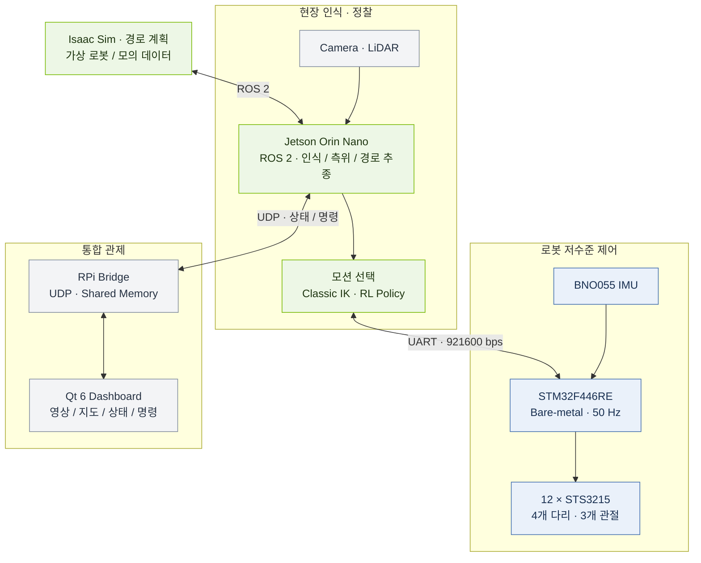

# 🏗️ 시스템 아키텍처

> **현장 인식 → 행동 결정 → 관절 제어 → 통합 관제**

## 01 · 전체 구성



## 02 · 모듈별 책임

| 모듈 | 담당 내용 | 소스 위치 |
| --- | --- | --- |
| **Perception** | 카메라 person 탐지, LiDAR 장애물·자유공간 처리 | `robot_ws/src/perception/` |
| **Localization** | 로봇 위치·보행 오도메트리·TF | `robot_ws/src/localization/spot_localization/` |
| **Navigation** | 로컬 경로 계획·진행 추적·경로 추종 | `robot_ws/src/navigation/spot_navigation/` |
| **Global planning** | 지도 기반 다중 로봇 경로 생성·발행 | `d_twin/ros2/planning/` |
| **Locomotion** | Classic IK와 RL 정책으로 관절 목표 생성 | `robot_ws/src/control/` |
| **Actuator bridge** | 선택된 관절 목표를 UART 프레임으로 변환 | `robot_ws/src/control/actuator_bridge/` |
| **Firmware** | 50 Hz 루프, 서보·IMU, 명령 유효성·상태 처리 | `firmware/Src/` |
| **Control station** | UDP 수신·공유메모리·Qt 상태 표시 | `rpi/bridge_app/`, `rpi/qt_app/` |

## 03 · 제어 흐름

```text
동작 선택                 관절 목표 생성                 하드웨어 반영
STAND / SIT / DETECT  ─┐
CLASSIC              ─┼─→ joint_target_mux ─→ actuator_bridge ─→ STM32 ─→ Servo
RL                   ─┘
```

`rl_motion_manager.launch.py`는 RL, 고전 제어, 서기·앉기·탐지 모션, mux, UART 브리지를 함께 구성합니다.
펌웨어 진입점은 `firmware/Src/main.c`의 `control_loop_run()` 호출입니다.
FreeRTOS 스케줄러를 사용하지 않습니다.

## 04 · 인터페이스

| 정의 | 기준 파일 |
| --- | --- |
| ROS 메시지 | `robot_ws/src/interfaces/robot_interfaces/` |
| Jetson ↔ STM32 프레임 | `firmware/Inc/spi_protocol.h` |
| UART 수신·DMA | `firmware/Inc/uart_jetson.h` |
| 로봇 ↔ 관제 UDP | `rpi/bridge_app/proto.h` |
| 브리지 ↔ Qt 공유메모리 | `rpi/bridge_app/shm_def.h` |

시뮬레이션과 실물 로봇의 수는 지도 및 송신 설정에 따라 달라집니다.
`shared/`는 정의 위치 안내용이며 별도 프로토콜 생성기를 포함하지 않습니다.

---

[🏠 Wiki 홈](Home.md) · [← 🏠 홈](Home.md) · [🚀 설치·빌드 →](Setup.md)
